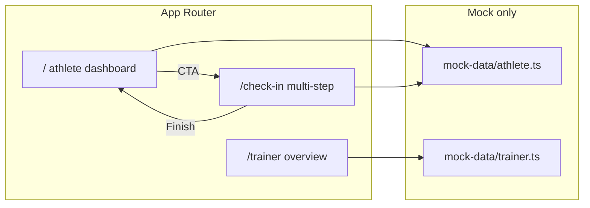

# Recovery Track — Lightweight Next.js MVP (Frontend Only)

## Context

The repo currently only has [docs/Recovery MVP — Mock UI & Workflow Design.md](/Users/christopherreyes/Projects/recoveryTrack/docs/Recovery%20MVP%20%E2%80%94%20Mock%20UI%20%26%20Workflow%20Design.md) and [docs/recovery_mvp_product_plan.pdf](/Users/christopherreyes/Projects/recoveryTrack/docs/recovery_mvp_product_plan.pdf). There is **no Next.js app yet**—the first step is scaffolding `recoveryTrack` as a Next.js + Tailwind project, then layering UI.

Design alignment: athlete greeting + recovery score card + summary metrics + streak + trainer compliance/overview matches the mock doc sections (“Athlete Home Dashboard”, “Daily Check-In Flow”, “Trainer Dashboard Layout”). Scope strictly follows **your** screen requirements (not full onboarding from the doc).

---

## 1. Project bootstrap

- Run `create-next-app` in [`/Users/christopherreyes/Projects/recoveryTrack`](/Users/christopherreyes/Projects/recoveryTrack) with: **App Router**, **TypeScript**, **Tailwind**, **ESLint**, **no** API routes beyond defaults, **`src/` directory optional**—prefer **`app/` at repo root** per your folder convention (if the CLI defaults to `src/app`, either accept it or use `--no-src-dir` if available for exact `app/` layout).
- Initialize shadcn/ui (`npx shadcn@latest init`) with **New York** or **Default** style—pick **Default** for slightly softer radius if it matches “large rounded cards”; tune radius in theme step.
- Add only the shadcn primitives needed: **`button`**, **`card`**, **`slider`**, **`badge`**, **`progress`** (optional for score ring feel), **`separator`**—keep the dependency surface small.

**Dependency note:** `lucide-react` ships with typical shadcn setups; use it for icons everywhere.

---

## 2. Global theme (WHOOP/Oura-adjacent)

Implement in [`app/globals.css`](/Users/christopherreyes/Projects/recoveryTrack/app/globals.css) + shadcn CSS variables:

- **Background:** deep navy / slate stack (e.g. base `slate-950` / `#020617`, layered surfaces `slate-900` / `slate-800`).
- **Foreground:** high-contrast muted white / `slate-100`–`slate-300` for secondary text.
- **Accents:** soft **emerald/teal** for positive states (`--primary` or a custom `--success`); **amber** for caution/warning badges and “watch” states.
- **Cards:** large radius (`rounded-2xl` / `rounded-3xl`), subtle borders (`border-white/10`), soft shadows optional but minimal.

**Layout shell:** [`app/layout.tsx`](/Users/christopherreyes/Projects/recoveryTrack/app/layout.tsx)—mobile-first centered column (`min-h-dvh`, `max-w-md mx-auto`, comfortable horizontal padding) so desktop viewing still feels like a phone prototype.

---

## 3. Mock data

Create small typed modules (plain objects/arrays, no persistence):

| File | Purpose |
|------|---------|
| [`mock-data/athlete.ts`](/Users/christopherreyes/Projects/recoveryTrack/mock-data/athlete.ts) | Greeting name, recovery score (e.g. 82), status copy, sleep/hydration/mood/soreness summaries, streak count, mini-trend placeholder labels |
| [`mock-data/trainer.ts`](/Users/christopherreyes/Projects/recoveryTrack/mock-data/trainer.ts) | Stats: total athletes, checked in, missed, at-risk count; `athletes[]` with name, score, last check-in label, quick sub-metrics, `status: 'healthy' \| 'watch' \| 'at-risk'` |

Export narrow types (e.g. `AthleteSummary`, `TrainerAthlete`) for reuse in cards.

---

## 4. Reusable components (under `components/`)

Keep files focused and composable:

- **`RecoveryScoreCard`** — Large score out of 100, positive message, optional subtle ring/progress (CSS or shadcn `Progress`), color keyed to score bands (green vs amber).
- **`MetricSummaryCard`** — Props: icon, label, value/status line; used four times on home.
- **`StreakCard`** — Weekly streak copy + icon.
- **`TrendPlaceholder`** — Gray gradient / dashed “chart area” with labels (“Sleep”, “This week”)—no chart library.
- **`PageHeader`** — Greeting line consistent across athlete/trainer if useful.
- **`TrainerStatCard`** — Numeric headline + label for the four KPIs.
- **`AthleteRowCard`** — Avatar placeholder (initials), name, score, last check-in, badge (`Healthy` / `Watch` / `At Risk`).
- **`StatusBadge`** — Maps status to emerald/amber/rose variants.

shadcn pieces live under **`components/ui/`** (standard convention)—your “reusable app components” stay in **`components/`** root or `components/recovery/` if you want one extra folder (optional; avoid deep nesting).

---

## 5. Routes and UX

### `/` — Athlete Home ([`app/page.tsx`](/Users/christopherreyes/Projects/recoveryTrack/app/page.tsx))

- Server component page that imports mock data and composes layout; interactive CTA links to `/check-in` via Next `<Link>` + shadcn `Button` (large, full-width on mobile).
- Sections in order: greeting → recovery score card → CTA → 2×2 grid of metric cards → streak → trend placeholder.

### `/check-in` — Daily check-in ([`app/check-in/page.tsx`](/Users/christopherreyes/Projects/recoveryTrack/app/check-in/page.tsx))

- **`'use client'`** wrapper component (e.g. `components/check-in/CheckInFlow.tsx`) holding `step` index (0–n) in `useState`.
- Steps (match your list):
  1. **Soreness** — shadcn `Slider`, numeric label (1–10), helper text “Fresh” ↔ “Extremely sore”; **body area pills** (`Toggle`-style buttons using `Button` `variant="outline"` / active state classes).
  2. **Hydration** — row/grid of quick-select buttons (Excellent / Good / Average / Poor).
  3. **Sleep** — compact quality control (segmented buttons or slider + optional hour buckets from mock doc—keep UI simple: quality scale + short labels).
  4. **Mood** — selectable chips/cards (Motivated, Neutral, Stressed, Exhausted, Anxious—or subset if cramped).
- **Footer:** large **Back** / **Next** buttons (`min-h-12` or taller), disable Back on first step; last step label **Finish** → `router.push('/')` (no persisted summary screen unless you want a fifth purely cosmetic “Done” step—**omit** to avoid scope creep unless time permits).
- **Transitions:** CSS-only—wrap step body in `transition-opacity duration-200` + `key={step}` for remount fade, or `translate-y` subtle animation via Tailwind `animate-in` if tailwindcss-animate is present after shadcn init. **No Framer Motion** unless you explicitly want it later.

### `/trainer` — Trainer dashboard ([`app/trainer/page.tsx`](/Users/christopherreyes/Projects/recoveryTrack/app/trainer/page.tsx))

- Top metric row (2×2 on narrow screens, 4-across at `sm+` if space).
- Scrollable list of `AthleteRowCard`.
- Sticky or prominent **Send Reminder** `Button` (full-width mobile)—non-functional aside from optional `alert`/visual pressed state for demos.

---

## 6. Navigation (prototype-only)

- Minimal bottom or top **internal nav** is optional; for interviews, **clear CTAs and bookmarks** may suffice. If adding nav: small link row on athlete home → Trainer (“demo”) linking to `/trainer`, and trainer page link back to `/`.

---

## 7. Quality bar

- Touch targets ≥ 44px where possible (buttons, pills, slider thumb).
- Typography: clear hierarchy (`text-3xl` score, `text-sm` muted labels).
- No API routes, no env secrets, no auth placeholders beyond copy.

---

## Architecture sketch

---

## Files to create / touch (high level)

- Scaffold: `package.json`, `next.config.*`, `tailwind.config.*`, `postcss.config.*`, `tsconfig.json`, `app/globals.css`, `app/layout.tsx`
- Routes: `app/page.tsx`, `app/check-in/page.tsx`, `app/trainer/page.tsx`
- Mock: `mock-data/athlete.ts`, `mock-data/trainer.ts`
- UI: `components/**/*` + `components/ui/*` (shadcn)

---

## Out of scope (per your instructions)

Auth, backend, DB, API routes, persistence, real charts, complex state machines, onboarding flows from the doc, wearable integration.
