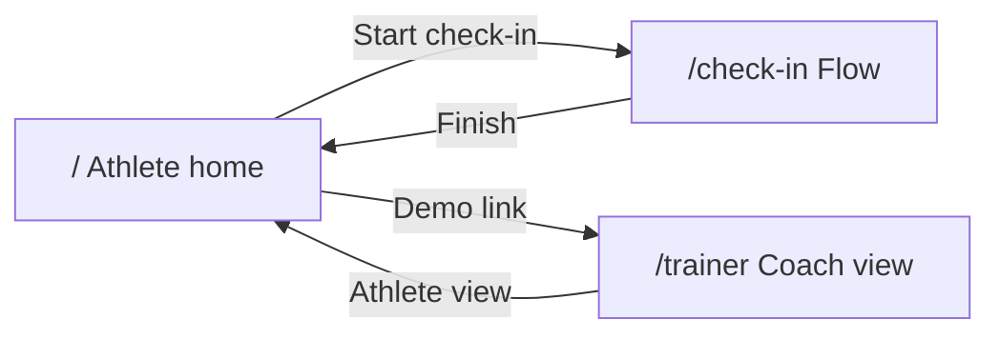

# Recovery Track — App overview

## What this is

**Recovery Track** is a **clickable frontend prototype** for a recovery-and-accountability product aimed at **athletes** (daily check-ins) and **trainers** (team overview and compliance). It is intended for **interviews and validation**, not production.

**Not implemented (by design):** authentication, backend, database, API routes, or persisted state. All numbers and roster data come from **mock modules** in the repo.

**Stack:** Next.js (App Router), React, Tailwind CSS, shadcn-style UI (Button, Card, Slider, Badge, Progress, Separator), Lucide icons.

**Visual direction:** Dark navy / slate surfaces, emerald accents for positive states, amber for caution, large rounded cards, mobile-first layout (centered column, phone-like width on desktop).

**Branding (UI):** The prototype surfaces **Sweat & Regret Recovery Club** — a top **wordmark** on every screen (`components/brand-bar.tsx`), copy in `lib/branding.ts` for the document title / meta description, and light “club” language on athlete, check-in, and coach screens.

---

## How the app works

### 1. Athlete home — `/`

- **Greeting** and a **large recovery score** (out of 100) with a short **status message**.
- **“Start Daily Check-In”** navigates to `/check-in`.
- **Summary tiles** for sleep, hydration, mood, and soreness (mock data).
- **Weekly streak** card and a **trend placeholder** (decorative “chart” area only—no chart library).
- Footer **link to the trainer dashboard** for demoing both roles in one session.

### 2. Daily check-in — `/check-in`

- **Multi-step client flow:** soreness (slider + optional body-area pills) → hydration (quick-select) → sleep (hours + quality slider) → mood (selectable options).
- **Back** / **Next**; last step shows **Finish**, which returns to **`/`**. Inputs are **not saved**—purely for UX demonstration.
- **Detailed spec:** [check-in-flow.md](check-in-flow.md).

### 3. Trainer dashboard — `/trainer`

- **Team stats** (mock): total athletes, checked in, missed check-ins, at-risk athletes.
- **Athlete list** with recovery score, last check-in label, sleep / soreness / mood snippets, and **Healthy / Watch / At Risk** badges.
- **Send Reminder** uses a **client-only demo** (browser `alert`)—no messaging backend.

---

## Flow (high level)

---

## One-sentence pitch

A **polished static demo** of three screens so you can walk stakeholders through how the product would **feel** before investing in real data, accounts, or infrastructure.

---

## Key files (reference)

| Area | Location |
|------|----------|
| Athlete home | `app/page.tsx` |
| Check-in flow | `app/check-in/page.tsx`, `components/check-in/check-in-flow.tsx` |
| Trainer dashboard | `app/trainer/page.tsx` |
| Mock athlete copy | `mock-data/athlete.ts` |
| Mock trainer roster | `mock-data/trainer.ts` |
| Theme / tokens | `app/globals.css`, `tailwind.config.ts` |
| Reusable UI | `components/*.tsx`, `components/ui/*` |

---

## More documentation

| Doc | Description |
|-----|-------------|
| [check-in-flow.md](check-in-flow.md) | Step-by-step check-in UX, gating rules, and state |
